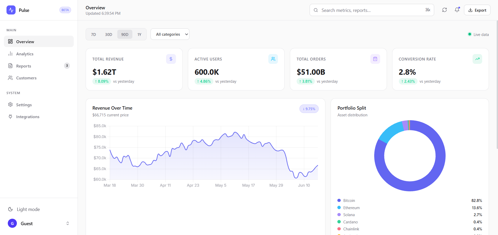
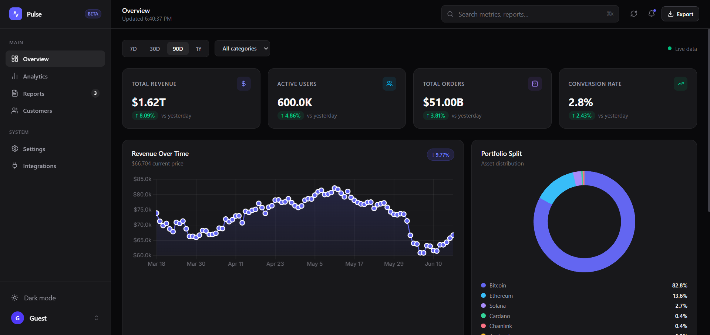
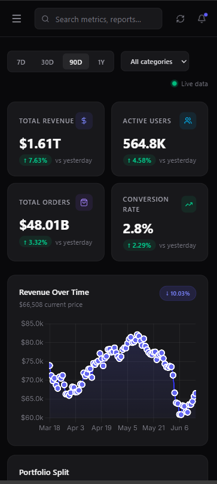

# Interactive Analytics Dashboard

A modern SaaS-style analytics dashboard built with HTML, CSS, and Vanilla JavaScript. This project demonstrates responsive design, dynamic data visualization, API integration, dark/light mode, and interactive filtering.

## Live Demo

https://zee7han0-dev.github.io/Analytics-Dashboard-Portfolio-Project/

## Features

- Responsive dashboard layout
- Sidebar navigation
- Interactive charts
- Analytics overview cards
- Dark / Light mode toggle
- LocalStorage theme persistence
- Dynamic filtering controls
- Real-time crypto market data
- Modern SaaS-inspired UI
- Mobile-friendly design
- Loading and error states

## Technologies Used

- HTML5
- CSS3
- JavaScript (ES6+)
- Chart.js
- CoinGecko API

## Dashboard Highlights

### Analytics Overview

- Revenue tracking
- User statistics
- Order metrics
- Conversion rate insights

### Interactive Charts

- Revenue trends
- Performance analytics
- Data visualization with Chart.js

### Theme System

- Dark mode
- Light mode
- User preference saved using localStorage

### Live Data

- Real-time cryptocurrency market data
- API integration using async/await
- Error handling and loading states

## Screenshots

### Light Mode

### Dark Mode

### Mobile View

## What I Learned

This project helped me improve my understanding of:

- Responsive layouts with CSS Grid and Flexbox
- JavaScript DOM manipulation
- Working with APIs using fetch and async/await
- Data visualization using Chart.js
- State management with localStorage
- Building professional dashboard interfaces
- Creating reusable and maintainable code

## Future Improvements

- Export analytics data
- Advanced filtering options
- User authentication
- Additional dashboard modules
- Backend integration

## Author

Zeeshan

Frontend Developer
